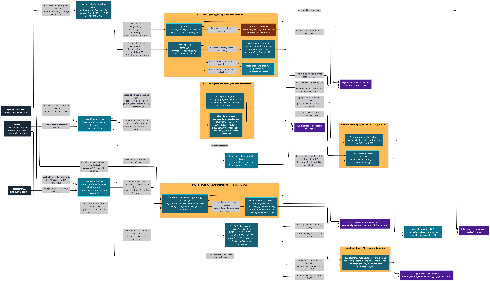

# Emergence of Mathematical Thinking in Transformers

**Geometric dynamics of internal representations in a decoder-only language model, before and during fine-tuning.**

A reproducible research pipeline that probes how arithmetic structure is represented inside **Pythia-1.4B** (24 layers, `d_model=2048`) and how those representations change under QLoRA fine-tuning on MetaMathQA. The project pairs *geometric* analyses (isotropy, CKA) with *behavioral* analyses (linear probes, output determinization) to separate what the model **represents** from what it **does**.

> Master's thesis, Università degli Studi di Napoli Federico II.
> Codebase: English. Thesis prose: Italian. Methodology and design are governed by the documents in [`docs/`](docs/).

---
## Project Map
<p align="center">
  
</p>

## Table of contents

- [Research questions](#research-questions)
- [Key findings](#key-findings)
- [Repository layout](#repository-layout)
- [Installation](#installation)
- [Data](#data)
- [Reproducing the pipeline](#reproducing-the-pipeline)
- [Configuration](#configuration)
- [Outputs and figures](#outputs-and-figures)
- [Testing](#testing)
- [Methodology and design discipline](#methodology-and-design-discipline)
- [Known constraints and caveats](#known-constraints-and-caveats)
- [Citing](#citing)

---

## Research questions

The project is organised around four research questions plus a supplementary dynamics track. Each is an independent, separately runnable stage that reads on-disk artifacts produced upstream.

| RQ | Question | Primary method | Verdict |
|----|----------|----------------|---------|
| **RQ1** | Does arithmetic *geometry* (isotropy / representational similarity) differ between math and control categories? | ΔIsotropy + linear CKA (evolutionary and inter-category) with a robustness battery | **Geometric null** — no math-specific similarity structure |
| **RQ2** | Is arithmetic structure (sign, parity) *linearly decodable* from hidden states? | L2 logistic probes per layer, permutation tests, BH-FDR, confound checks | **Strong, with one confound** — sign and parity decodable; sign leaks operand magnitude |
| **RQ3** | How do representations *move* under fine-tuning? | Frozen-probe accuracy trajectories + dual Frobenius drift across checkpoints | **Real, attention-mediated drift**; frozen probes decay |
| **RQ4** | Does the model *behaviorally determinize* at the `=` token as it trains? | Next-token entropy, P(answer), top1−top2 logit margin across checkpoints | **Yes, on the trained distribution** |
| **Supp.** | How does RQ1 geometry evolve per checkpoint? | RQ1 metrics recomputed on fine-tuned states | Exploratory bridge between RQ1 and RQ3 |

A full data-flow diagram of every stage, artifact, and metric is in [`docs/Pipeline_Dataflow.md`](docs/Pipeline_Dataflow.md) (Mermaid).

---

## Key findings

These are the validated, on-disk results — the headline numbers the thesis defends.

**RQ1 — geometry is a null.** Inter-category CKA (math↔control) at the terminal layer is ≈ 0.010, which sits *at the matched control↔control and within-math-across-template baselines* (≈ 0.020). A full robustness battery (debiased CKA tracking biased at r ≈ 0.997, uniformly high Procrustes distances, low leave-k-out influence) finds no outlier-driven or method-artifact structure. The one real geometric signal is isotropy: math is modestly *more* isotropic, with ΔIso ≈ −0.106 at L15. A random-Gaussian floor (≈ 0 in `d=2048` vs. real ≈ 0.88–0.99) confirms anisotropy is the normal state, so ΔIso is read strictly as a relative measure.

**RQ2 — probing is the strong result.** Sign is linearly decodable from layer 0 (accuracy 0.925), peaking at 1.000 by L3, BH-significant at all 24 layers. Parity emerges later (L6), with a two-stage profile — a plateau (~0.66–0.72 through L12) followed by a jump to ~0.94 at L13 — peaking at 0.990 at L15. **Confound caveat:** the sign probe's logits correlate with operand-1 magnitude (r ≈ 0.55–0.67, all layers leak-significant); this is dataset-intrinsic (for `a − b`, sign tracks `op1 − op2`). Parity, by contrast, is clean (logit↔op2-parity r ≤ 0.199). Sign and parity share the same BH-significance flag but differ by an order of magnitude in effect size — the project's clearest "significance ≠ effect size" exhibit.

**RQ3 — fine-tuning relocates representations.** Relative Frobenius drift peaks at 0.690 at L9 (math drifts ~1.8× more than control). Because QLoRA targets QKV only (MLP frozen), all drift is attention-mediated. Drift exceeds the NF4 quantization floor (0.153) with an SNR of ~4.5×. The substantive finding: **frozen-probe accuracy decays under fine-tuning** (sign mean 0.99 → 0.74; upper layers fall most) — base-model probes no longer fit the moved representations.

**RQ4 — the output distribution sharpens.** At the `=` token, across checkpoints, P(correct answer token) rises monotonically in both math categories (sign 0.069 → 0.340; parity 0.108 → 0.365). For the clean single-token-result case, entropy falls and logit margin rises monotonically. GSM8K 0-shot accuracy climbs 0.000 → 0.171 over training. The honest scope: the model determinizes on the **trained distribution**, not on math reasoning broadly (GSM8K reaches only ~17%).

> **Note on artifacts.** All `results/` files are git-ignored. Only code, configs, tests, and docs are versioned. Reproduce the numbers by running the pipeline below.

---

## Repository layout

```
.
├── run_rq1.py                 # RQ1 — emergence geometry (isotropy + CKA) orchestrator
├── run_rq1_dynamics.py        # Supplementary — RQ1 geometry recomputed per checkpoint
├── run_rq2.py                 # RQ2 — linear probing + permutation + BH-FDR
├── run_rq3.py                 # RQ3 — frozen-probe trajectories + Frobenius drift (per checkpoint)
├── run_rq4.py                 # RQ4 — determinization metrics at the "=" token (per checkpoint)
│
├── src/
│   ├── config/                # SSOT registries: categories, model profiles, TypedDict schemas
│   │   ├── categories.py      #   the 4-category registry (ALL_CATS)
│   │   ├── models.py          #   get_model_profile(): hf_path, target_modules, batch size
│   │   └── schemas.py         #   canonical PropConfig (shared by probing + validator)
│   ├── dataset/               # Stimulus construction and the v5 master assembly
│   │   ├── build_stimuli.py   #   arithmetic stimuli (sign/parity)
│   │   ├── build_control.py   #   neutral / numeric controls
│   │   ├── merge_stimuli.py   #   assemble + tokenize → dataset_master_v5.jsonl
│   │   └── regenerate_dataset.py  # one-shot reproducible regeneration (non-destructive by default)
│   ├── extraction/            # Hidden-state extraction
│   │   ├── extract_states.py  #   base-model "=" terminal-token states (RQ1/RQ2)
│   │   └── checkpoint_loop.py #   per-checkpoint re-extraction (RQ3)
│   ├── finetuning/
│   │   └── train_qlora.py     # QLoRA SFT on MetaMathQA (NF4, r=16, QKV-only)
│   ├── metrics/               # Geometry
│   │   ├── cka.py             #   linear CKA, debiased CKA, Procrustes, leave-k-out (protected: linear_cka)
│   │   └── isotropy.py        #   isotropy_exact + random-Gaussian floor (protected: isotropy_exact)
│   ├── probing/               # Linear probing engine + statistics + IO
│   │   ├── engine.py          #   per-layer probe fit/eval (LayerResult)
│   │   ├── pipeline.py        #   orchestration glue
│   │   ├── probing_dataset.py #   data loading, splitting, category filtering
│   │   ├── stats.py           #   benjamini_hochberg_correction, bootstrap_ci (accuracy-specific)
│   │   ├── seeds.py           #   get_seed(base, purpose, offset) — the only RNG entry point
│   │   ├── io_utils.py        #   atomic CSV/JSON/NPY writers + load_hidden_states
│   │   ├── run_confound_checks.py        # N-01 sign↔operand-1 leak
│   │   └── run_parity_confound_checks.py # N-02 parity↔op2-parity (clean)
│   ├── eval/
│   │   ├── eval_gsm8k.py      # 0-shot GSM8K per checkpoint (+ binomial CI, step parsing)
│   │   ├── nf4_degradation.py # NF4 quantization floor baseline (SNR vs RQ3 drift)
│   │   └── determinization.py # RQ4 pure metrics: entropy / margin / P(answer) + RQ4 row contract
│   ├── utils/
│   │   └── validate_configs.py # strict YAML schema validator
│   └── viz/                   # Plotly/Matplotlib dashboards (one runner per RQ)
│       ├── plot_rq1_emergence.py
│       ├── plot_rq2_probing.py        # accuracy + emergence markers + parity-jump shading
│       ├── probing_viz.py             # accuracy curves + effect-size-vs-significance bars
│       ├── plot_rq3_trajectory.py
│       ├── plot_rq4_determinization.py
│       ├── plot_ft_geometry_dynamics.py
│       └── pca_umap_viz.py            # PCA/UMAP scatter incl. 2-class math-vs-ctrl @ terminal layer
│
├── configs/
│   ├── config_rq2.yaml        # the production config (RQ1–RQ4 read from it)
│   ├── config_template.yaml   # documented template of every key
│   ├── config_test.yaml       # tiny config used by the e2e tests
│   └── lora_config.yaml       # QLoRA hyperparameters
│
├── docs/                      # Authority documents (see "Methodology" below)
│   ├── Guida_Metodologica.md      # epistemological principles (E-G-*, E-M-*, E-F-*, E-O-*, E-P-*)
│   ├── Approccio_Architetturale.md# architectural decisions (ARCH-*, S-*, C-*, B-*)
│   ├── Specifica_Progetto.md      # full project specification
│   └── Pipeline_Dataflow.md       # Mermaid data-flow diagram
│
├── tests/                     # pytest suite (CPU-only; mocks the model/tokenizer)
├── requirements.txt           # curated runtime pins
├── requirements_exact.txt     # full frozen environment
├── pyproject.toml             # package metadata (requires-python >= 3.10)
└── CLAUDE.md                  # contributor/agent conventions and invariants
```

---

## Installation

Requires **Python ≥ 3.10** and (for extraction, fine-tuning, GSM8K, and RQ4) a CUDA GPU. Analysis-only stages that read pre-extracted states run on CPU.

```bash
git clone https://github.com/riccardobonagura/Emergence-of-Mathemathical-Thinking-in-Transformers.git
cd Emergence-of-Mathemathical-Thinking-in-Transformers
git checkout dev

python -m venv .venv && source .venv/bin/activate
pip install -r requirements.txt        # curated pins
# or: pip install -r requirements_exact.txt   # exact frozen environment
pip install -e .                       # installs the src package
```

> **Critical pin:** `transformers>=4.46,<4.49`. Versions ≥ 4.49 trigger a GPT-NeoX vmap/SDPA bug that breaks extraction and fine-tuning (see `ENV-02` in `checkpoint_loop.py`). Do not relax this bound.

Heavy dependencies: `torch`, `peft`, `transformer-lens`, `bitsandbytes` (NF4 quantization), `lm-eval` (GSM8K), `scikit-learn`, `plotly`.

---

## Data

The dataset is **3000 stimuli across 4 categories** (`CAT-SIGN`, `CAT-PARITY`, `CTRL-NEU`, `CTRL-NUM`), each math prompt ending in `=`. Arithmetic operands are drawn from `[10, 50]`; subtraction can yield negatives. The canonical master lives at `data/processed/dataset_master_v5.jsonl`.

Regenerate it reproducibly (non-destructive by default — writes a `*_regenerated.jsonl` unless `--commit`):

```bash
python -m src.dataset.regenerate_dataset --n_pairs 500 --n_control 500 --seed 42
# add --commit to overwrite the canonical master, --with-extraction to re-extract states (GPU)
```

---

## Reproducing the pipeline

Stages are ordered. Analysis stages assume the states they consume already exist on disk. Most invocations take a single `--config`; per-checkpoint stages also take a directory or are looped externally.

```bash
CFG=configs/config_rq2.yaml

# 0. Validate the config before anything else
python -m src.utils.validate_configs --probing $CFG

# 1. Extract base-model "=" hidden states (GPU)  →  data/processed/<model_name>/layer_*.pt
python -m src.extraction.extract_states --config $CFG

# 2. RQ1 — emergence geometry (CPU)              →  results/rq1_emergence/
python run_rq1.py --config $CFG

# 3. RQ2 — linear probing + confounds (CPU)      →  results/rq2_probing/
python run_rq2.py --config $CFG
python -m src.probing.run_confound_checks --config $CFG
python -m src.probing.run_parity_confound_checks --config $CFG

# 4. Fine-tune with QLoRA on MetaMathQA (GPU)    →  data/processed/checkpoints/
python -m src.finetuning.train_qlora --config configs/lora_config.yaml

# 5. Re-extract checkpoint states (GPU)          →  data/processed/checkpoints_extracted/
python -m src.extraction.checkpoint_loop --config $CFG

# 6. RQ3 — frozen-probe trajectories + drift (per checkpoint)
python run_rq3.py --config $CFG --checkpoint_dir data/processed/checkpoints_extracted/<ckpt>

# 7. GSM8K 0-shot per checkpoint (GPU)           →  results/gsm8k/
python -m src.eval.eval_gsm8k --config $CFG --tag baseline --model_path EleutherAI/pythia-1.4b
python -m src.eval.eval_gsm8k --config $CFG --tag final --model_path <adapter_path> --loading_strategy peft

# 8. NF4 degradation baseline (GPU)              →  results/nf4_degradation/
python -m src.eval.nf4_degradation --config $CFG

# 9. RQ4 — determinization at "=" (GPU)          →  results/rq4_determinization/
python run_rq4.py --config $CFG

# 10. Supplementary FT geometry dynamics
python run_rq1_dynamics.py --config $CFG
```

Then build the dashboards (see [Outputs and figures](#outputs-and-figures)).

> RQ4 loads each checkpoint in turn (step 0 = the un-merged base model; adapters are merged in memory into a TransformerLens model with the same flags RQ3 uses), runs a single forward pass over the math stimuli, and gathers the logits at the `=` position. It is inference-only and deterministic — no retraining, no RNG.

---

## Configuration

All stages read one YAML. `configs/config_rq2.yaml` is the production config; `configs/config_template.yaml` documents every key. Selected keys:

| Key | Meaning |
|-----|---------|
| `model_name` | Profile key into `get_model_profile()` (`pythia-1.4b` → `EleutherAI/pythia-1.4b`, QKV target modules, batch 32) |
| `seed` | Global base seed; all RNG flows through `get_seed(seed, purpose)` |
| `train_split`, `C`, `solver`, `max_iter` | Probe training (note: `C=1.0`; a C-sweep showed accuracy invariant over {0.01…10.0}) |
| `properties` | Per-probe spec (`type`, `label_field`, `category`, `class_names`) — validated against the canonical `PropConfig` schema |
| `n_permutation_tests`, `bootstrap_n_samples`, `bootstrap_ci` | Statistical rigour for RQ2 |
| `total_training_steps` | 12343 — terminal step, fixes the RQ3/RQ4/GSM8K step axis `{0, 2500, 5000, 7500, 10000, 12343}` |
| `rq4_batch_size`, `rq4_output_dir` | RQ4 inference batch and output directory |

New keys are always read with `config.get(key, default)` so the minimal `config_test.yaml` (used by the test suite) never raises on a missing key.

---

## Outputs and figures

Each RQ writes a self-contained results directory and has a dedicated dashboard runner.

| Stage | Data artifact | Dashboard |
|-------|---------------|-----------|
| RQ1 | `results/rq1_emergence/cka_results_annotated.csv`, `isotropy_aggregated_balanced.csv` | `python -m src.viz.plot_rq1_emergence` |
| RQ2 | `results/rq2_probing/accuracy_metrics_corrected.csv`, `confound_checks_hardened.csv`, `parity_confound_checks.csv` | `python -m src.viz.plot_rq2_probing` |
| RQ3 | `results/rq2_probing/dynamic/trajectories_probing.csv` | `python -m src.viz.plot_rq3_trajectory` |
| RQ4 | `results/rq4_determinization/determinization.csv` (+ per-step JSON) | `python -m src.viz.plot_rq4_determinization` |
| Supp. | `results/rq1_emergence/dynamic/rq1_dynamics.csv` | `python -m src.viz.plot_ft_geometry_dynamics` |
| Geometry scatter | base / checkpoint states | `python -m src.viz.pca_umap_viz --layers 23 --reducer pca` |

The RQ2 dashboard overlays per-property emergence markers and shades the parity L12→L13 jump; the confound figure plots effect size against BH-significance (the E-M-03 exhibit). The 2-class PCA at the terminal layer is captioned faithfully: the visible separation tracks the high-variance terminal-`=` positional axis, **not** math-specific geometry — consistent with the near-baseline inter-category CKA.

---

## Testing

```bash
pytest tests/        # CPU-only; no GPU, no real model or tokenizer required
```

The suite mocks `load_hidden_states` with synthetic tensors and exercises the pure-function cores (probe algebra, CKA robustness, isotropy floor, NF4 SNR, RQ4 entropy/margin/P on synthetic logit matrices) plus mock-driven end-to-end runs of each RQ. `tests/check_hardware.py` and `tests/check_interface.py` are standalone environment probes; `tests/generate_fixtures.py` builds the e2e fixtures.

---

## Methodology and design discipline

The repository is governed by an explicit authority order — when source and docs disagree, the docs win, in this order:

1. **`docs/Guida_Metodologica.md`** — epistemological principles, e.g. `E-G-01` (anisotropy is the normal state; read isotropy relatively), `E-M-03` (statistical significance ≠ effect size), `E-P-02` (the `=` distribution encodes the model's expected result), `E-O-*` (reproducibility/seeding).
2. **`docs/Approccio_Architetturale.md`** — architectural decisions: `ARCH-03` (TypedDicts on inter-module handoffs), `S-*` single-source-of-truth rules, `B-*` change-scoping rules.
3. **Source code.**

A few invariants worth knowing before contributing (full list in `CLAUDE.md`):

- **Seeding** goes only through `get_seed(base_seed, purpose, offset)`. No bare `default_rng(42)`.
- **IO** goes only through the atomic writers in `io_utils.py`, always `encoding="utf-8"`.
- **Protected surfaces** — `linear_cka`, `isotropy_exact`, and the test-locked `cka_inter_mean` name are byte-stable; new behavior is added as new functions, never by editing these.
- **Validation discipline** — results are validated by reading the regenerated artifact, never by trusting a summary. The two real bugs caught during development (a with-replacement CKA deflation and a CI-bracket/bias conflict) were found exactly this way.

---

## Known constraints and caveats

- **Domain.** Operands in `[10, 50]`, three prompt templates (`E-P-04`) — findings are within-distribution.
- **RQ4 tokenization (B6).** Subtraction results can be negative or two-digit and tokenize as multiple tokens under GPT-NeoX. `P(correct answer token)` is a true probability only on the single-token-result subset (1500/2000 math rows); for the 500 negative results the first answer token is the sign (`" -"`). Entropy and logit margin are position metrics and are reported on the full set, with single-token-restricted variants provided to isolate the digit half of `CAT-SIGN`.
- **Causality.** All cross-stage relationships (drift ↔ probe decay ↔ determinization ↔ GSM8K) are correlational, n = 6 checkpoint steps (`E-O-01`).
- **Scope of "determinization."** The model sharpens on the trained distribution; GSM8K generalization stays low (~17%).

---

## Citing

If you use this code or its findings, please cite the thesis:

```bibtex
@mastersthesis{bonagura_emergence_transformers,
  author = {Bonagura, Riccardo},
  title  = {Emergence of Mathematical Thinking in Transformers:
            Geometric Dynamics in Internal Representations},
  school = {Università degli Studi di Napoli Federico II},
  year   = {2026}
}
```

Model: [EleutherAI/pythia-1.4b](https://huggingface.co/EleutherAI/pythia-1.4b). Fine-tuning corpus: MetaMathQA.
