# Pipeline data-flow map — math-annotated

Each edge is labelled with the **operation / math** applied to the upstream
artifact. Note that the `RQ*` stages are **not atomic**: every RQ fans out into
distinct computations that produce distinct on-disk results.

- **RQ1** → two independent geometries: *isotropy* (per-category cosine
  structure) **and** *inter-category CKA* (math-vs-control relational structure).
- **RQ2** → two probes (*sign*, *parity*), each with its **own confound test**.
- **RQ3** → frozen-probe *accuracy* trajectory **and** *dual-Frobenius drift*.

```mermaid
%%{init: {"flowchart": {"curve": "basis", "nodeSpacing": 45, "rankSpacing": 55}} }%%
flowchart TD

    %% ───────────────────────── Sources ─────────────────────────
    MODEL["<b>Pythia-1.4B (base)</b><br/>24 layers · d_model=2048"]:::src
    DS["<b>dataset_master_v5.jsonl</b><br/>4 cats · 3000 stimuli<br/>(CAT-SIGN, CAT-PARITY,<br/>CTRL-NEU, CTRL-NUM)"]:::data
    MMQA["<b>MetaMathQA</b><br/>fine-tuning corpus"]:::src

    %% ───────────────────────── Extraction ──────────────────────
    EXT["<b>Base hidden states</b><br/>layer_00..23.pt · FP16 [n,2048]<br/>+ metadata.json"]:::data
    MODEL -->|"tokenize stimuli → forward pass →<br/>gather '=' terminal token h_l"| EXT
    DS    -->|"stimuli text + category labels"| EXT

    %% ═══════════════════════ RQ1 (NON-ATOMIC) ═══════════════════
    subgraph RQ1 ["RQ1 — emergence geometry (two distinct metrics)"]
        direction TB
        ISO["ΔIso per category<br/>isotropy_aggregated_balanced.csv<br/><i>ΔIso ≈ −0.1056 @ L15</i>"]:::res
        CKA["Inter-category CKA<br/>cka_results_annotated.csv<br/><i>math/ctrl @ L23 = 0.9257 / 0.8865</i>"]:::res
    end
    EXT -->|"mean off-diagonal cosine sim<br/>cos = ⟨ĥ_i, ĥ_j⟩ over i≠j<br/>(exact Gram / Monte-Carlo) + bootstrap CI"| ISO
    EXT -->|"linear CKA = HSIC(K,L) / √(HSIC(K,K)·HSIC(L,L))<br/>K=XXᵀ, L=YYᵀ centered: K_c = H·K·H"| CKA

    %% ═══════════════════════ RQ2 (NON-ATOMIC) ═══════════════════
    subgraph RQ2 ["RQ2 — linear probing (two probes, two confounds)"]
        direction TB
        SIGN["Sign probe<br/>accuracy_metrics_corrected.csv<br/><i>emerge L0 · peak 1.000 @ L3</i>"]:::res
        PAR["Parity probe<br/>same CSV<br/><i>emerge L6 · peak 0.990 @ L15</i>"]:::res
        SCONF["Sign N-01 confound<br/>confound_checks_hardened.csv<br/><i>r ≈ 0.625 ⚠</i>"]:::warn
        PCONF["Parity confound<br/>parity_confound_checks.csv<br/><i>r = 0.090 ✓ clean</i>"]:::res
        WTS["Frozen probe weights (w,b)<br/>weights/*.npy + rq2_config_hash.json"]:::data
    end
    EXT -->|"StandardScaler → LogReg(L2, C)<br/>label = sign · acc + bootstrap CI<br/>+ 5-fold permutation test"| SIGN
    EXT -->|"StandardScaler → LogReg(L2, C)<br/>label = parity · acc + bootstrap CI<br/>+ 5-fold permutation test"| PAR
    SIGN -->|"Pearson r( ŷ , |operand₁| )"| SCONF
    PAR  -->|"Pearson r( ŷ , magnitude )"| PCONF
    SIGN -->|"denormalize: w_orig=w/σ, b_orig=b−w·μ"| WTS
    PAR  -->|"denormalize: w_orig=w/σ, b_orig=b−w·μ"| WTS

    %% ═══════════════════════ Fine-tuning ════════════════════════
    FT["<b>QLoRA checkpoints</b><br/>2500/5000/7500/10000 + final_adapter<br/><i>step 12343 · 1 epoch · train loss ≈ 2.58</i>"]:::data
    MODEL -->|"QLoRA NF4 · r=16 · QKV-only<br/>(MLP frozen) · ~3.1M trainable"| FT
    MMQA  -->|"causal-LM SFT · effective batch 32"| FT

    CKEXT["<b>Re-extracted checkpoint states</b><br/>checkpoints_extracted/<br/>5 checkpoints × 24 layers"]:::data
    FT -->|"merge adapter into base →<br/>re-extract '=' token states"| CKEXT

    %% ═══════════════════════ RQ3 (NON-ATOMIC) ═══════════════════
    subgraph RQ3 ["RQ3 — fine-tuning dynamics (accuracy + drift)"]
        direction TB
        R3ACC["Frozen-probe acc trajectory<br/>dynamic/trajectories_probing.csv<br/><i>sign 0.994 → 0.739</i>"]:::res
        R3DRIFT["Dual Frobenius drift<br/>same CSV<br/><i>rel math 0.0 → 0.690</i>"]:::res
    end
    WTS   -->|"apply frozen probe (NO refit):<br/>ŷ = 1 if X·w + b > 0 (hash-verified)"| R3ACC
    CKEXT -->|"X_test = checkpoint states[test_idx]"| R3ACC
    CKEXT -->|"‖H_ckpt − H_base‖_F  ÷(N·d)  and  ÷‖H_base‖_F<br/>(dim-normalized + relative, math & ctrl)"| R3DRIFT
    EXT   -.->|"H_base reference"| R3DRIFT

    %% ═══════════════════════ NF4 baseline (T16) ═════════════════
    NF4["NF4 degradation baseline (T16)<br/>nf4_degradation/summary.json<br/><i>mean rel Frob 0.153 · cos 0.98–0.999</i>"]:::res
    MODEL -->|"bf16-ref vs double-quant NF4, per layer:<br/>rel Frobenius ‖Δ‖_F/‖ref‖_F + mean cosine"| NF4

    %% ═══════════════════════ GSM8K eval ═════════════════════════
    GSM["GSM8K 0-shot accuracy<br/>gsm8k/gsm8k_*.json<br/><i>0.000 → 0.099 → 0.136 → 0.152 → 0.161 → 0.171<br/>(step 0 → 12343, +17.1pp, monotonic)</i>"]:::res
    FT -->|"0-shot generate → exact-match acc<br/>+ bootstrap CI (per checkpoint)"| GSM

    %% ═══════════════════════ Merge + Visualize ══════════════════
    TRAJ["<b>Unified trajectory CSV</b><br/>dynamic/trajectories_probing.csv<br/>(+ gsm8k_acc, gsm8k_ci_*)"]:::data
    R3ACC   --> TRAJ
    R3DRIFT --> TRAJ
    GSM -->|"merge gsm8k_acc + CI per step"| TRAJ

    %% ═══════════ Supplementary (exploratory bridge RQ1↔RQ3) ════════════════
    subgraph SUPP ["Supplementary — FT geometry dynamics (exploratory, NOT an RQ)"]
        direction TB
        SUPPCSV["RQ1 geometry recomputed per checkpoint<br/>rq1_emergence/dynamic/rq1_dynamics.csv<br/><i>ΔIso, inter-cat CKA, cross-temporal CKA(base→ckpt)</i>"]:::res
    end
    EXT   -.->|"H_base reference (cross-temporal CKA)"| SUPPCSV
    CKEXT -->|"reuse isotropy_exact + linear_cka /<br/>compute_cka_intercategory (no refit)"| SUPPCSV
    SUPPV["Supplementary dashboard<br/>results/figures/supplementary_ft_dynamics.html"]:::viz
    SUPPCSV --> SUPPV
    GSM -.->|"descriptive overlay only (n=6, E-G-04)"| SUPPV

    VIZ1["RQ1 emergence dashboard<br/>results/figures/"]:::viz
    VIZ3["RQ3 trajectory dashboard<br/>results/figures/"]:::viz
    ISO  --> VIZ1
    CKA  --> VIZ1
    SIGN --> VIZ1
    PAR  --> VIZ1
    TRAJ --> VIZ3
    NF4  -.->|"degradation disclosure (E-F-03)"| VIZ3

    %% ───────────────────────── Styling ─────────────────────────
    classDef src  fill:#1f2937,stroke:#9ca3af,color:#f9fafb,stroke-width:1px;
    classDef data fill:#0e7490,stroke:#67e8f9,color:#f0fdff,stroke-width:1px;
    classDef res  fill:#155e75,stroke:#22d3ee,color:#ecfeff,stroke-width:1px;
    classDef warn fill:#7c2d12,stroke:#fb923c,color:#fff7ed,stroke-width:1px;
    classDef viz  fill:#4c1d95,stroke:#c4b5fd,color:#f5f3ff,stroke-width:1px;

    style RQ1 fill:#082f49,stroke:#38bdf8,color:#e0f2fe
    style RQ2 fill:#082f49,stroke:#38bdf8,color:#e0f2fe
    style RQ3 fill:#082f49,stroke:#38bdf8,color:#e0f2fe
    style SUPP fill:#1c1917,stroke:#a8a29e,color:#fafaf9,stroke-dasharray:5 4
```

> **Supplementary node (dashed border):** `run_rq1_dynamics.py` recomputes RQ1's
> descriptive geometry on the QLoRA checkpoints (reuse-only) and adds a cross-temporal
> CKA(base→checkpoint) drift. It is an **exploratory bridge between RQ1 and RQ3, not part
> of either RQ's confirmatory design**. GSM8K co-movement is descriptive only (n=6;
> E-G-04/E-M-02/E-O-04); evolutionary layer-to-layer CKA is out of scope.

## Legend

| Shape / colour | Meaning |
|---|---|
| Dark grey | External source (model weights, raw corpus) |
| Teal (solid) | On-disk artifact / intermediate data |
| Cyan (inside subgraph) | Result metric written to a results CSV/JSON |
| Orange | Result flagged as a confound risk (⚠) |
| Purple | Visualization dashboard |
| Solid arrow | Primary data flow (label = math/operation applied) |
| Dashed arrow | Reference / contextual dependency (not a transform) |

### Why the `RQ*` boxes contain two nodes each
- **RQ1** runs `isotropy.py` (mean off-diagonal cosine, exact Gram or
  Monte-Carlo) *and* `cka.py` (linear CKA via HSIC) — two unrelated geometries
  over the same hidden states.
- **RQ2** fits an independent `StandardScaler→LogisticRegression` probe per
  property (*sign*, *parity*), each followed by its own Pearson confound test;
  the denormalized weights are frozen for RQ3.
- **RQ3** reuses the **frozen** RQ2 weights for an accuracy trajectory (no
  refit, `rq2_config_hash.json`-verified) *and* computes a separate dual
  Frobenius drift (dim-normalized + relative) — geometry change is measured
  independently of probe accuracy.
