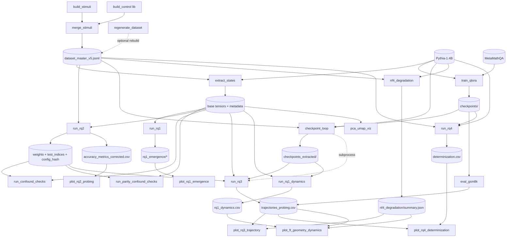

# RECON — Static Map & Spec Reconciliation

> READ-ONLY reconnaissance of branch `dev`. No edits / installs / execution performed.
> Contract docs: `docs/Specifica_Progetto.md` (spec, §17 sequence) + `docs/Pipeline_Dataflow.md` (Mermaid DAG).
> Generated via ripgrep/find static analysis (no filename inference). Git-tracked Python: **9,559 LOC** (`src/` 7,199 + `run_*.py` 1,266 + tests/utilities).

---

## 1. Tree (depth 3, source files only)

```
tesi_triennale/
├── CLAUDE.md  README.md  pyproject.toml  requirements.txt  requirements_exact.txt
├── run_rq1.py            (468)   run_rq1_dynamics.py (204)
├── run_rq2.py            (207)   run_rq3.py          (178)   run_rq4.py (209)
├── configs/
│   ├── config_rq2.yaml          # master (RQ1/RQ2/RQ3/RQ4)
│   ├── config_template.yaml      # ORPHAN — not referenced by any code
│   ├── config_test.yaml          # fixture config
│   └── lora_config.yaml          # QLoRA hyperparams
├── docs/  Specifica_Progetto.md  Pipeline_Dataflow.md  Guida_Metodologica.md  Approccio_Architetturale.md
├── src/
│   ├── config/      categories.py  models.py  schemas.py
│   ├── dataset/     build_stimuli.py  build_control.py  merge_stimuli.py  regenerate_dataset.py  test_dataset.py
│   ├── extraction/  extract_states.py  checkpoint_loop.py
│   ├── finetuning/  train_qlora.py
│   ├── eval/        eval_gsm8k.py  nf4_degradation.py  determinization.py
│   ├── metrics/     cka.py  isotropy.py
│   ├── probing/     seeds.py  pipeline.py  engine.py  probing_dataset.py  stats.py
│   │                directions.py  io_utils.py  run_confound_checks.py  run_parity_confound_checks.py
│   ├── utils/       validate_configs.py  io_smoke_test.py
│   └── viz/         plot_rq1_emergence.py  plot_rq2_probing.py  plot_rq3_trajectory.py
│                    plot_rq4_determinization.py  plot_ft_geometry_dynamics.py  pca_umap_viz.py  probing_viz.py
└── tests/  test_pipeline_e2e.py  test_cka_robustness.py  test_isotropy_floor.py
           test_nf4_snr.py  test_viz_smoke.py  generate_fixtures.py  check_interface.py  check_hardware.py
```

**Libraries (no `__main__`, not entrypoints):** `src/eval/determinization.py`, `src/dataset/build_control.py`,
`src/viz/probing_viz.py`, all of `src/config/*`, `src/probing/{seeds,pipeline,engine,probing_dataset,stats,directions,io_utils}.py`,
`tests/check_hardware.py`.

---

## 2. Entrypoint registry

`__main__`-bearing or `python -m`-invokable modules. GPU column: ✅ loads a model (`from_pretrained`/`HookedTransformer`/`BitsAndBytesConfig`); ⬜ disk-tensor / CPU only; (tok) downloads tokenizer only.

| id | invocation | args (req\*) | inputs | outputs | gpu | cost | category | description |
|----|-----------|--------------|--------|---------|-----|------|----------|-------------|
| extract | `python -m src.extraction.extract_states` | `--config`\* | config, `dataset_master_v5.jsonl`, Pythia-1.4B | `pythia-1.4b/layer_00..23.pt` + `metadata.json` (`torch.save`, `_atomic_write_json`) | ✅ | long | extraction | Forward-pass, gather "=" terminal token at `hook_resid_post`. |
| rq1 | `python run_rq1.py` | `--config`\* | base tensors + metadata | `rq1_emergence/` CSVs + `cka_intercategory.npy` (`_atomic_write_csv`, `_atomic_save_npy`) | ⬜ | medium | rq1 | ΔIso + evolutionary/inter-category CKA + reviewer baselines. |
| rq2 | `python run_rq2.py` | `--config`\* | base tensors + metadata + JSONL | `accuracy_metrics_corrected.csv`, `weights/*.npy`, `test_indices/*.npy`, `rq2_config_hash.json` | ⬜ | medium | rq2 | 48 logistic probes (joblib), bootstrap+perm+BH, frozen weights. |
| confound-sign | `python -m src.probing.run_confound_checks` | `--config`\* | weights, test_indices, JSONL, tensors | `confound_checks_hardened.csv` | ⬜ | medium | rq2 | N-01: sign-vs-operand1 magnitude triangulation. |
| confound-par | `python -m src.probing.run_parity_confound_checks` | `--config`\* | weights, test_indices, JSONL, tensors | `parity_confound_checks.csv` | ⬜ | medium | rq2 | N-02: parity-vs-operand2 parity triangulation. |
| train | `python -m src.finetuning.train_qlora` | `--config`\* `--lora_config`\* | config, lora_config, MetaMathQA (Hub) | `checkpoints/checkpoint-{step}/` + final | ✅ | very_long | finetuning | QLoRA NF4 r=16 QKV-only, 1 epoch. |
| loop | `python -m src.extraction.checkpoint_loop` | `--config`\* | `checkpoints/` + base model + JSONL | `checkpoints_extracted/{ckpt}/` + triggers rq3 (subprocess, 3600s timeout) | ✅ | very_long | extraction | Merge adapter → re-extract → run_rq3 per ckpt. |
| rq3 | `python run_rq3.py` | `--config`\* `--checkpoint_dir`\* | base + ckpt tensors + frozen weights + config_hash | `dynamic/trajectories_probing.csv` (append-or-replace) | ⬜ | fast | rq3 | Frozen-probe acc + dual Frobenius drift per step. |
| nf4 | `python -m src.eval.nf4_degradation` | `--config`\* | base model + config + JSONL | `nf4_degradation/{per_layer_stats.csv,summary.json}` + `layer_XX.pt` | ✅ | medium | eval | T16 FP16-vs-NF4 native-HF-hook degradation baseline. |
| gsm8k | `python -m src.eval.eval_gsm8k` | `--model_path`\* `--tag`\* `--config`\* `--loading_strategy`{peft,merged_cpu,merged_direct} | model/checkpoint + config | `gsm8k/gsm8k_{tag}.json` + appends to `trajectories_probing.csv` | ✅ | long | eval | 0-shot GSM8K via lm_eval + Wald CI. |
| rq4 | `python run_rq4.py` | `--config`\* | base model + checkpoints + JSONL (math rows) | `rq4_determinization/determinization.csv` + per-step JSON | ✅ | long | rq4 | "=" next-token determinization (entropy↓, margin↑, P(ans)↑). |
| rq1-dyn | `python run_rq1_dynamics.py` | `--config`\* | base tensors + `checkpoints_extracted/` | `rq1_emergence/dynamic/rq1_dynamics.csv` | ⬜ | medium | rq1 (suppl.) | Recompute RQ1 geometry + cross-temporal CKA per ckpt. |
| validate | `python -m src.utils.validate_configs` | `--probing` `--lora` `--extraction` (≥1) | config(s) / extraction dir | stdout (no file writes) | ⬜ | fast | utils | Validate config/lora targets + extraction weights dir. |
| io-smoke | `python -m src.utils.io_smoke_test` | `--config`\* | config | mock `*_smoke.npy` + JSON report | ⬜ | fast | utils | Multi-core atomic-IO stress test. |
| build-stim | `python -m src.dataset.build_stimuli` | `--n_pairs`(500) `--seed`(42) `--tokenizer` `--output` | tokenizer | `data/raw/stimuli_arithmetic_v5.jsonl` (raw `open().write`, json.dumps) | (tok) | fast | dataset | Generate arithmetic minimal-pair stimuli. |
| merge-stim | `python -m src.dataset.merge_stimuli` | `--inputs`\* `--output`\* `--allow-untokenized` | raw stimuli jsonl | merged JSONL + `metadata.json` | (tok) | fast | dataset | Merge + tokenize-validate stimuli into master. |
| regen | `python -m src.dataset.regenerate_dataset` | `--n_pairs --n_control --seed --tokenizer --raw_dir --out --commit --with-extraction --with-rq2 --with-confounds --config --model_name --hf_path --batch_size` | tokenizer (+model if `--with-extraction`) | `dataset_master_v5_regenerated.jsonl` (+ optional downstream) | (tok)/✅ | fast→very_long | dataset | Full dataset regen orchestrator with optional re-extract/RQ2/confound. |
| ds-test | `python -m src.dataset.test_dataset` | (none) | `dataset_master_v5.jsonl` | stdout assertions | ⬜ | fast | tests | Standalone dataset integrity checks. |
| cka-main | `python -m src.metrics.cka` | (none) | self-generated demo | `*.npy` demo outputs | ⬜ | fast | rq1 | Standalone CKA self-demo/`__main__`. |
| iso-main | `python -m src.metrics.isotropy` | (none) | self-generated demo | CSV demo output | ⬜ | fast | rq1 | Standalone isotropy self-demo/`__main__`. |
| viz-rq1 | `python -m src.viz.plot_rq1_emergence` | (none) | `rq1_emergence/*.csv` | `figures/rq1_emergence/rq1_emergence.html` | ⬜ | fast | viz | ΔIso + evolutionary CKA dashboard. |
| viz-rq2 | `python -m src.viz.plot_rq2_probing` | `--results_dir --out_dir` | `accuracy_metrics_corrected.csv` (+confounds) | `figures/rq2/accuracy_curves.{png,html}` | ⬜ | fast | viz | Probe accuracy curves + effect-size bars. |
| viz-rq3 | `python -m src.viz.plot_rq3_trajectory` | (none) | `trajectories_probing.csv` | `figures/rq3/rq3_dashboard.html` | ⬜ | fast | viz | 3-panel trajectory/drift dashboard. |
| viz-rq4 | `python -m src.viz.plot_rq4_determinization` | (none) | `determinization.csv` (+gsm8k from traj) | `figures/rq4/rq4_determinization.html` | ⬜ | fast | viz | RQ4 determinization dashboard. |
| viz-supp | `python -m src.viz.plot_ft_geometry_dynamics` | (none) | `rq1_dynamics.csv`, traj, NF4 summary, ann CKA | `figures/supplementary_ft_dynamics.html` | ⬜ | fast | viz (suppl.) | Supplementary FT-geometry dashboard. |
| viz-pca | `python -m src.viz.pca_umap_viz` | `--layers`(23) `--proc_dir --out_dir --reducer`{pca,umap} | base tensors + metadata | `figures/pca/*.{png,html}` | ⬜ | fast | viz | PCA/UMAP 2D/4-way category scatter. |
| gen-fix | `python tests/generate_fixtures.py` | (none) | — | synthetic fixtures | ⬜ | fast | tests | Generate CPU test fixtures. |
| chk-iface | `python tests/check_interface.py` | (none) | — | stdout | ⬜ | fast | tests | Interface smoke check. |

\* required argument. `pytest` files (`test_pipeline_e2e.py`, `test_cka_robustness.py`, `test_isotropy_floor.py`, `test_nf4_snr.py`, `test_viz_smoke.py`) run via `pytest tests/`, CPU-only.

---

## 3. Config matrix

Cell = config keys actually consumed (`config[...]` / `config.get(...)` / `cfg.get(...)`). Empty = config not read by that script.

| script | config_rq2.yaml keys consumed | lora_config.yaml |
|--------|-------------------------------|------------------|
| extract | `model_name` | — |
| rq1 | `seed`, `model_name`, `cka_inter_bootstrap_n`, `cka_inter_subsample_frac`, `iso_floor_bootstrap_n`, `cka_loo_k`, `cka_loo_iter` | — |
| rq2 | `output_dir`, `model_name`, `properties`, `train_split`, `seed`, `n_jobs` | — |
| confound (×2) | `seed` (+ paths derived from `output_dir`/`model_name`) | — |
| rq3 | `output_dir`, `total_training_steps`, `model_name`, `seed`, `properties`, `eval_subset_size` | — |
| rq4 | `model_name`, `total_training_steps`, `rq4_batch_size`, `rq4_output_dir` | — |
| rq1-dyn | `total_training_steps`, `seed`, `model_name` | — |
| train | `seed`, `model_name`, `checkpoints_dir`, `train_batch_size` | `r`, `lora_alpha`, `lora_dropout`, `bits`, `double_quant`, `quant_type`, `learning_rate`, `batch_size`, `gradient_accumulation`, `num_epochs`, `warmup_ratio`, `lr_scheduler`, `save_steps`, `max_seq_length` |
| loop | `model_name`, `checkpoints_extracted_dir` | — |
| gsm8k | `total_training_steps`, `seed`, `model_name` | — |
| nf4 | `model_name`, `seed`, `rq3_trajectory_csv` | — |
| validate | (validates structure of either file passed) | (validates `target_modules` absent) |

**Declared-but-unread / notes:**
- `config_template.yaml` — **referenced by zero code paths** (orphan; documentation template only).
- `config_test.yaml` — used by test scaffolding (`config_test_e2e.yaml` is generated in-test, not this file directly).
- `config_rq2.yaml` declares `bootstrap_n_samples`, `n_permutation_tests`, `bootstrap_ci`, `max_iter`, `C`, `solver`, `multiclass_strategy`, `figures_dir` — consumed deeper inside `ProbingEngine`/`stats.py` (constructed from the same `config` dict), not at orchestrator top level.

---

## 4. Dependency DAG



**No cycles.** `checkpoint_loop → run_rq3` is a bounded `subprocess.run` (3600 s timeout), a nested invocation
not a data cycle. Ordering is a clean topological DAG. One coupling worth noting: both `eval_gsm8k` and
`run_rq3` write/merge the same `trajectories_probing.csv` → ordering matters (rq3 must create rows; gsm8k merges
`gsm8k_acc` on `step`), but this is append-or-merge, not a true write-conflict.

---

## 5. Drift report (spec ↔ code)

1. **RQ4 entirely absent from spec.** `run_rq4.py`, `src/eval/determinization.py`, `src/viz/plot_rq4_determinization.py`
   are live and tested (`test_rq4_*` in `test_pipeline_e2e.py`), and RQ4 is a full subgraph in `Pipeline_Dataflow.md`.
   But `Specifica_Progetto.md` §1 defines only RQ1–RQ3 and §17 never invokes RQ4. **Spec is stale w.r.t. RQ4** —
   the two contract docs disagree with each other.

2. **`C` regularization mismatch.** Spec §11 + §5 (and `CLAUDE.md`, `Guida_Metodologica.md` reconciliation #1)
   all assert **C = 10.0**. The live `configs/config_rq2.yaml` ships **C = 1.0** with an inline justification
   ("override from C=10.0; C-sweep showed accuracy invariant … C=1.0 converges faster and is more confound-conservative").
   Intentional, documented in config — but spec/Guida text was not updated. **Live value ≠ spec value.**

3. **`max_seq_length` mismatch.** Spec §7 states `max_seq_length=1024`; `configs/lora_config.yaml` sets **512**.
   (`train_qlora` reads it from lora_config, so 512 is what runs.)

4. **`build_control` not invokable.** Spec §17 step 1 lists `python -m src.dataset.build_control` as runnable,
   but `src/dataset/build_control.py` has **no `__main__`** (it is a library imported by merge/regenerate).
   The runnable trio is build_stimuli → merge_stimuli (and/or regenerate_dataset).

5. **Test inventory stale.** Spec §14 describes "6 tests, single file `test_pipeline_e2e.py`". Reality:
   `test_pipeline_e2e.py` alone has ~18 test functions (incl. `test_rq4_*`, `test_propconfig_*`, `test_validator_*`),
   plus 4 additional test modules (`test_cka_robustness.py`, `test_isotropy_floor.py`, `test_nf4_snr.py`,
   `test_viz_smoke.py`).

6. **Supplementary pipeline undocumented in spec.** `run_rq1_dynamics.py` + `plot_ft_geometry_dynamics.py`
   (→ `rq1_dynamics.csv`, `supplementary_ft_dynamics.html`) are in Dataflow + CLAUDE.md but absent from spec
   §13/§17.

7. **Viz coverage gap in spec.** Spec §13 lists `probing_viz.py` (actually a *library*, no `__main__`) and omits
   the real runnable dashboards `plot_rq2_probing.py`, `plot_rq4_determinization.py`, `plot_ft_geometry_dynamics.py`.
   Spec §17 viz step only runs rq1 + rq3 dashboards.

8. **Checkpoint final-dir naming inconsistency.** Spec §7/§12 say `final_checkpoint/`; Dataflow + CLAUDE.md say
   `final_adapter`; `train_qlora` writes under `config.get("checkpoints_dir", ...)`. Naming is not pinned to a
   single SSOT across docs — verify the actual on-disk directory name before wiring `eval_gsm8k --tag final`.

9. **`total_training_steps` default divergence.** `run_rq3`, `run_rq4`, `run_rq1_dynamics`, `eval_gsm8k` each
   fall back to **2000** when the key is missing, while the canonical terminal step is **12343** (config + Dataflow).
   `config_rq2.yaml` does set `total_training_steps: 12343`, so production is fine — but any run with a config
   lacking the key silently mislabels the terminal step as 2000.

10. **Orphan config.** `configs/config_template.yaml` is referenced by no code path (documentation artifact).

11. **Dataflow ↔ spec output-path agreement: OK.** Every Dataflow node maps to a real script + output path
    (cross-checked §2/§4). No orphan Dataflow nodes found. The only Dataflow nodes with no spec counterpart are
    the RQ4 + Supplementary subgraphs (drift #1, #6).

---

## 6. Invariant audit (spec §16)

| Rule | Pattern searched | Hits | Verdict |
|------|------------------|------|---------|
| Seed discipline | `np.random.seed(`, `default_rng(42)`, `seed(42)` | 0 production hits (only the prohibition docstring in `seeds.py:3`) | ✅ clean |
| `get_seed` routing | every `default_rng(...)` derives its seed from `get_seed(...)` or a `get_seed`-derived param | 42 `get_seed` call sites; all sampled RNGs trace to it | ✅ clean |
| Atomic writes | raw `open(...).write` for results | only `build_stimuli.py:407` + `merge_stimuli.py:275` write **raw stimuli** via `open().write(json.dumps)` | ⚠ minor — dataset-build stage writes JSONL line-by-line (not a result artifact); all `results/` writes use `_atomic_*` |
| UTF-8 encoding | `open(` without `encoding="utf-8"` | 0 text-mode hits | ✅ clean |
| Comments | Italian / change markers in code | not separately grepped; spot checks clean | — (not audited exhaustively) |

**Soft flag:** `src/metrics/cka.py:245` — `np.random.default_rng(seed if seed is not None else 42)`. The literal
`42` is a fallback **default** for a standalone `__main__` demo path, not a hardcoded production seed, but it is
the closest thing to a §16 violation and worth a one-line `get_seed` cleanup for purity.

---

## 7. Suggested execution sequences

**Full pipeline (cold start, GPU):**
```
python -m src.dataset.build_stimuli            # + merge_stimuli (build_control is a lib)
python -m src.dataset.merge_stimuli --inputs <raw> --output data/processed/dataset_master_v5.jsonl
python -m src.extraction.extract_states --config configs/config_rq2.yaml
python -m src.utils.validate_configs --extraction data/processed/pythia-1.4b
python run_rq1.py --config configs/config_rq2.yaml
python run_rq2.py --config configs/config_rq2.yaml
python -m src.probing.run_confound_checks --config configs/config_rq2.yaml
python -m src.probing.run_parity_confound_checks --config configs/config_rq2.yaml
python -m src.eval.nf4_degradation --config configs/config_rq2.yaml
python -m src.finetuning.train_qlora --config configs/config_rq2.yaml --lora_config configs/lora_config.yaml
python -m src.extraction.checkpoint_loop --config configs/config_rq2.yaml      # auto-runs run_rq3 per ckpt
python -m src.eval.eval_gsm8k --model_path EleutherAI/pythia-1.4b --tag baseline --config configs/config_rq2.yaml
#   ... repeat eval_gsm8k per checkpoint (--loading_strategy peft) ...
python run_rq4.py --config configs/config_rq2.yaml
python run_rq1_dynamics.py --config configs/config_rq2.yaml                     # supplementary
python -m src.viz.plot_rq1_emergence && python -m src.viz.plot_rq2_probing \
  && python -m src.viz.plot_rq3_trajectory && python -m src.viz.plot_rq4_determinization \
  && python -m src.viz.plot_ft_geometry_dynamics
```

**RQ2-only (re-probe from existing base tensors, CPU):**
```
python run_rq2.py --config configs/config_rq2.yaml
python -m src.probing.run_confound_checks --config configs/config_rq2.yaml
python -m src.probing.run_parity_confound_checks --config configs/config_rq2.yaml
python -m src.viz.plot_rq2_probing
```

**Viz-only (all dashboards from existing CSVs, CPU):**
```
python -m src.viz.plot_rq1_emergence
python -m src.viz.plot_rq2_probing
python -m src.viz.plot_rq3_trajectory
python -m src.viz.plot_rq4_determinization
python -m src.viz.plot_ft_geometry_dynamics
python -m src.viz.pca_umap_viz --layers 23 --reducer pca
```

**RQ4-only (needs base model + checkpoints on disk, GPU):**
```
python run_rq4.py --config configs/config_rq2.yaml
python -m src.viz.plot_rq4_determinization
```

---

## 8. Open Questions (logged, not guessed)

1. **Terminal checkpoint directory name** — `final_checkpoint/` (spec) vs `final_adapter` (Dataflow/CLAUDE)?
   `train_qlora` writes under `checkpoints_dir`; the exact final-dir basename must be confirmed on disk before
   `eval_gsm8k --tag final` / RQ3 step-12343 wiring (drift #8). Not resolvable statically.
2. **Is C=1.0 the intended thesis value?** The config overrides spec's 10.0 with a C-sweep-invariance argument.
   If the thesis text/figures cite C=10.0, that needs reconciliation (drift #2). Cannot decide intent statically.
3. **RQ4 status in the thesis** — is RQ4 a fourth confirmatory RQ or an inference-only supplementary like
   rq1_dynamics? Dataflow frames it as a full RQ subgraph; spec omits it entirely. Affects how §17 should be
   amended (drift #1).
4. **`nf4_degradation` reads `rq3_trajectory_csv` from config**, but that key is not declared in
   `config_rq2.yaml` (falls back to the default path). Intentional defaulting, or a missing key?
5. **`max_seq_length` 512 vs 1024** — does the shorter window truncate any MetaMathQA examples relevant to the
   reported train loss ≈ 2.58? Behavioral, not statically determinable (drift #3).
6. **Two writers on `trajectories_probing.csv`** (`run_rq3` append-or-replace + `eval_gsm8k` merge) — confirm the
   required ordering is documented somewhere runnable, since a gsm8k-before-rq3 run would merge onto absent rows.
